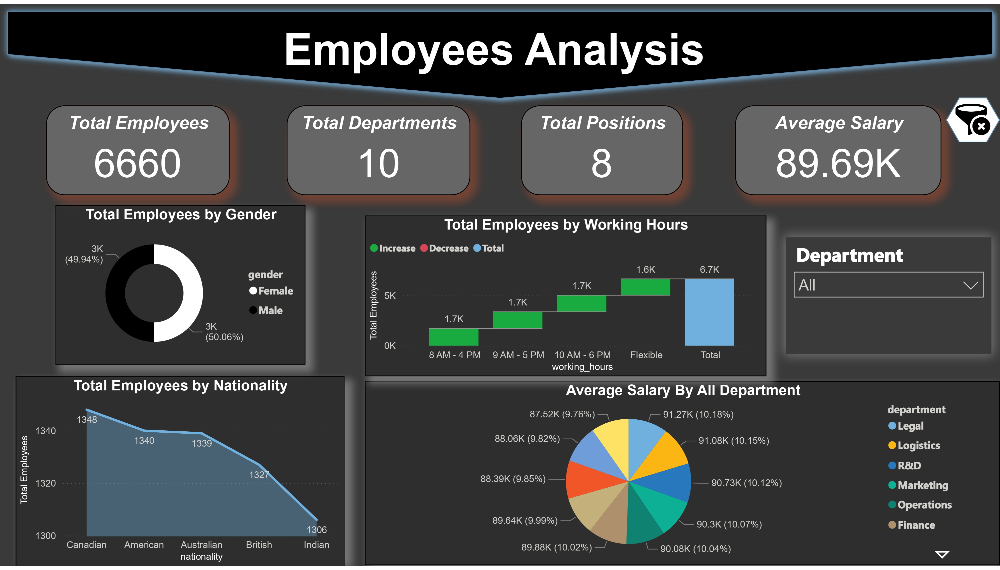
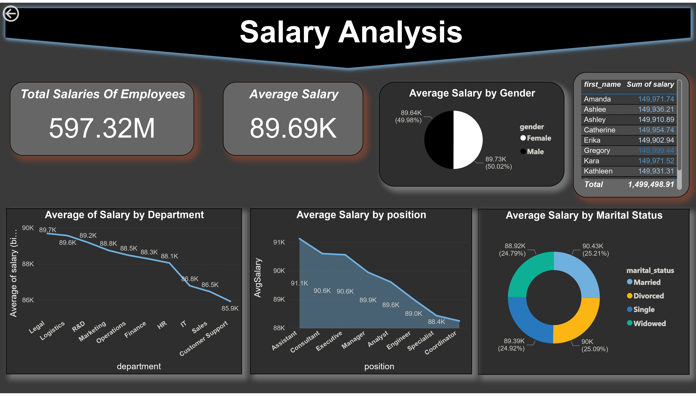
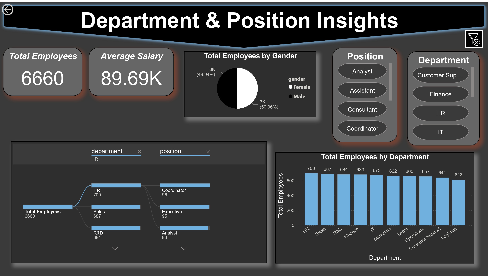

# 📊 Employee Data Power BI Report

This project is a comprehensive Power BI report analyzing employee data to support HR and management decision-making. The report visualizes key metrics such as demographics, salary distribution, departmental insights, and working hour patterns.

---

## 📌 Project Overview

The Employee Data Dashboard includes:
- Total workforce overview (Headcount, Departments, Positions)
- Salary analysis (by gender, department, position, marital status)
- Demographics (age distribution, nationality, gender)
- Work schedule trends (shift timings and age correlation)
- Department and role-level comparisons

---

## 🧾 Key Metrics

- **Total Employees**: 6,660  
- **Average Salary**: ₹89.69K  
- **Total Salary**: ₹597.32M  
- **Departments Analyzed**: 10  
- **Positions**: 8  
- **Gender Ratio**: ~50% Male / 50% Female

---

## 🛠️ Tech Stack

- **Power BI Desktop**
- **Data Source**: CSV/Excel (employee dataset)
- **Transformations**: Power Query
- **Calculated Fields**: DAX Measures

---

## 🗂️ Report Structure

1. **Employees Overview**
2. **Salary Analysis**
3. **Department & Position Insights**
4. **Working Hours Breakdown**

---

# 📊 Employee Data Report

## Overview

## Salary Analysis

## Department Breakdown

